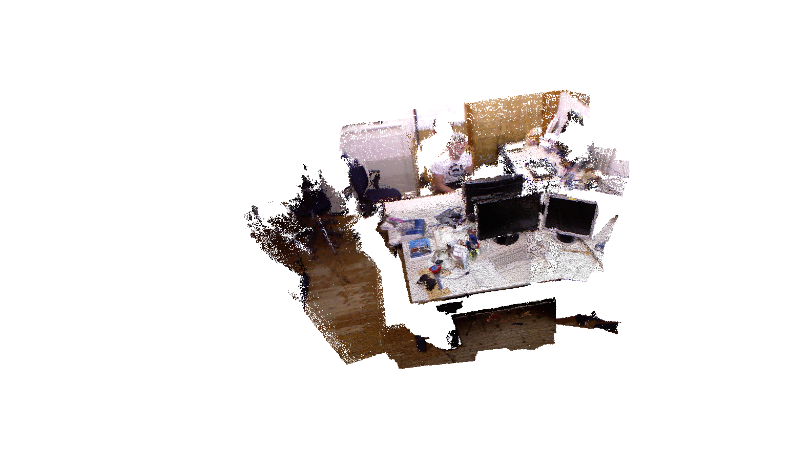
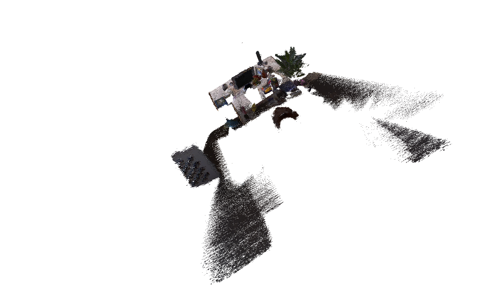

# 3D-Mesh-from-Depth
Simple 3D mesh generation by back-projecting depth values

One of the exercises completed as a part of 3D Scanning and Motion Capture (IN2354) module at TUM. Back-projecting depth values from set of camera frames to generate a 3D global mesh. Tested on **freiburg1_xyz** and **freiburg2_xyx** datasets (available here: https://vision.in.tum.de/data/datasets/rgbd-dataset/download). 

Library dependency: 
- Eigen Lib
    - To install on Ubuntu: **sudo apt install libeigen3-dev**

**Results**
    
    
